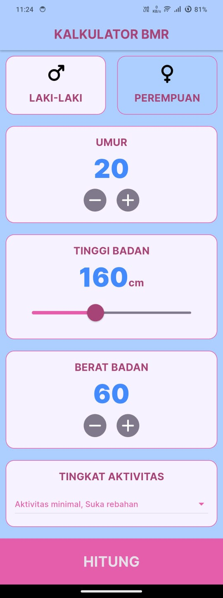
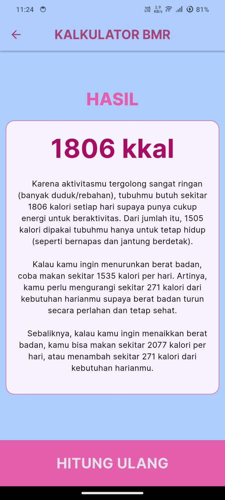

# BMR Calculator

Aplikasi Flutter sederhana untuk menghitung **BMR (Basal Metabolic Rate)** dan **TDEE (Total Daily Energy Expenditure)** berdasarkan data pengguna seperti usia, berat badan, tinggi badan, jenis kelamin, serta tingkat aktivitas harian.

---

## Tampilan Aplikasi

| Input Page | Result Page |
|-------------|--------------|
|  |  |

---

## Fitur Utama

- Menghitung **BMR** menggunakan rumus **Mifflin-St Jeor**  
- Menentukan **TDEE** berdasarkan tingkat aktivitas  
- Menampilkan rekomendasi kalori untuk:
  - Menurunkan berat badan  
  - Menjaga berat badan  
  - Menaikkan berat badan  

---

## Teknologi yang Digunakan

- Flutter  
- Dart  
- Material Design  
- Font Awesome Icons 
- Google Fonts  

---

## Pengembang

- Alfia Nur Ihsani (K3523009) 
- Arina Al Haq (K3523019)
- Asshyari Intan P. N. (K3523021) 